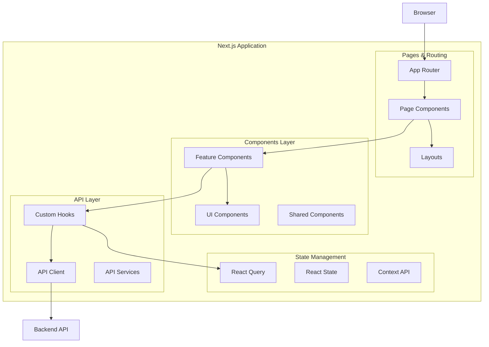
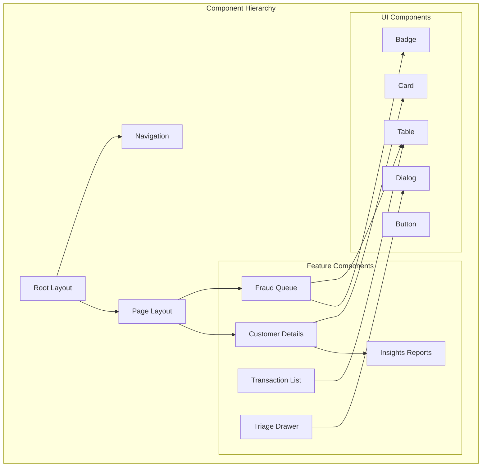
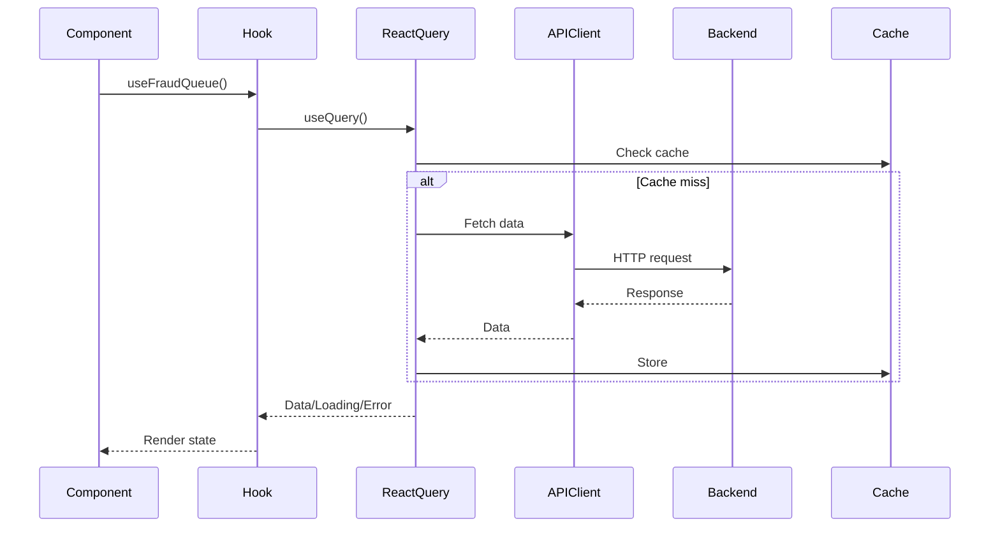
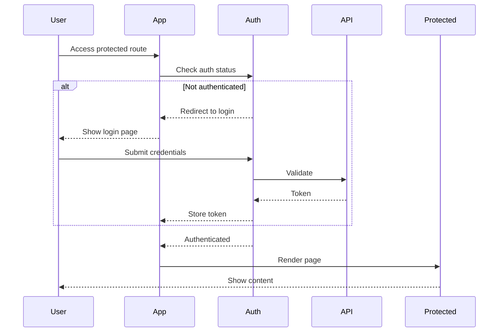

# Frontend Documentation - Next.js Application

## 🏗️ Frontend Architecture



## 📁 Project Structure

```
apps/frontend/
├── app/                    # Next.js App Router
│   ├── layout.tsx         # Root layout
│   ├── page.tsx           # Home page
│   ├── dashboard/         # Dashboard routes
│   ├── customers/         # Customer routes
│   ├── transactions/      # Transaction routes
│   └── settings/          # Settings routes
├── components/            # React components
│   ├── ui/               # Shadcn UI components
│   ├── charts/           # Data visualization
│   ├── navigation.tsx    # Main navigation
│   └── *.tsx            # Feature components
├── lib/                  # Utilities and configs
│   ├── api/             # API client and services
│   ├── hooks/           # Custom React hooks
│   ├── utils.ts         # Utility functions
│   └── store.ts         # State management
├── styles/              # Global styles
└── public/              # Static assets
```

## 🎨 Component Architecture



## 🔄 Data Flow & State Management



## 🎯 Key Components

### 1. Fraud Queue Component
```tsx
// components/fraud-queue.tsx
export function FraudQueue() {
  const { data: alerts, isLoading } = useFraudQueue();
  
  return (
    <DataTable
      columns={columns}
      data={alerts}
      onRowClick={handleTriageOpen}
    />
  );
}
```

### 2. Triage Drawer
```tsx
// components/triage-drawer.tsx
export function TriageDrawer({ alert, onClose }) {
  const triageMutation = useRunTriage();
  
  return (
    <Sheet open={!!alert} onOpenChange={onClose}>
      <SheetContent>
        {/* Risk analysis dashboard */}
        {/* AI recommendations */}
        {/* Action buttons */}
      </SheetContent>
    </Sheet>
  );
}
```

### 3. Customer Insights
```tsx
// components/insights-reports.tsx
export function InsightsReports({ customerId }) {
  const { data: insights } = useCustomerInsights(customerId);
  const generateReport = useGenerateReport();
  
  return (
    <Card>
      <SpendChart data={insights.spending} />
      <CategoryBreakdown data={insights.categories} />
      <ReportGenerator onGenerate={generateReport} />
    </Card>
  );
}
```

## 🪝 Custom Hooks

### API Hooks
```typescript
// lib/hooks/useFraud.ts
export function useFraudQueue(status?: string) {
  return useQuery({
    queryKey: ['fraud-queue', status],
    queryFn: () => fraudApi.getFraudQueue(status),
    refetchInterval: 5000, // Live polling
  });
}

export function useRunTriage() {
  return useMutation({
    mutationFn: fraudApi.runTriage,
    onSuccess: () => {
      queryClient.invalidateQueries(['fraud-queue']);
    },
  });
}
```

### State Hooks
```typescript
// lib/hooks/useLocalStorage.ts
export function useLocalStorage<T>(key: string, initialValue: T) {
  const [storedValue, setStoredValue] = useState<T>(initialValue);
  
  useEffect(() => {
    const item = window.localStorage.getItem(key);
    if (item) setStoredValue(JSON.parse(item));
  }, [key]);
  
  const setValue = (value: T) => {
    setStoredValue(value);
    window.localStorage.setItem(key, JSON.stringify(value));
  };
  
  return [storedValue, setValue] as const;
}
```

## 🎨 UI Component Library

### Shadcn/UI Components
- **Card**: Container component
- **Button**: Interactive buttons
- **Dialog**: Modal dialogs
- **Sheet**: Side drawer
- **Table**: Data tables
- **Badge**: Status indicators
- **Select**: Dropdown menus
- **Tabs**: Tab navigation

### Custom Components
- **DataTable**: Enhanced table with sorting/filtering
- **MetricCard**: KPI display
- **RiskIndicator**: Risk level visualization
- **TimelineChart**: Time-series visualization
- **ExportDialog**: Data export UI

## 🚀 Routing Structure

```
/                           # Home/Landing
/dashboard                  # Main dashboard
/customers                  # Customer list
/customers/[id]            # Customer details
/transactions              # Transaction list
/transactions/[id]         # Transaction details
/fraud                     # Fraud queue
/insights                  # Analytics
/knowledge-base           # KB articles
/evaluations              # Model evals
```

## 🔐 Authentication Flow



## 📊 Data Visualization

### Chart Components
```tsx
// Spend Trend Chart
<ResponsiveContainer width="100%" height={300}>
  <LineChart data={spendData}>
    <XAxis dataKey="date" />
    <YAxis />
    <Tooltip />
    <Line type="monotone" dataKey="amount" stroke="#8884d8" />
  </LineChart>
</ResponsiveContainer>

// Risk Distribution
<ResponsiveContainer width="100%" height={300}>
  <PieChart>
    <Pie data={riskData} dataKey="value" nameKey="name" cx="50%" cy="50%">
      {riskData.map((entry, index) => (
        <Cell key={index} fill={COLORS[index % COLORS.length]} />
      ))}
    </Pie>
    <Tooltip />
  </PieChart>
</ResponsiveContainer>
```

## 🎯 Performance Optimization

### Code Splitting
```tsx
// Dynamic imports for route-based splitting
const CustomerDetails = dynamic(() => import('./customer-details'), {
  loading: () => <LoadingSpinner />,
});
```

### Image Optimization
```tsx
import Image from 'next/image';

<Image
  src="/logo.png"
  alt="Logo"
  width={200}
  height={50}
  priority
/>
```

### Memoization
```tsx
const MemoizedExpensiveComponent = memo(({ data }) => {
  const processedData = useMemo(() => 
    expensiveCalculation(data), [data]
  );
  
  return <Chart data={processedData} />;
});
```

## 🧪 Testing

### Component Testing
```tsx
// __tests__/FraudQueue.test.tsx
describe('FraudQueue', () => {
  it('renders fraud alerts', async () => {
    render(<FraudQueue />);
    await waitFor(() => {
      expect(screen.getByText('High Risk')).toBeInTheDocument();
    });
  });
});
```

### Hook Testing
```tsx
// __tests__/hooks/useFraud.test.ts
describe('useFraudQueue', () => {
  it('fetches fraud queue data', async () => {
    const { result } = renderHook(() => useFraudQueue());
    await waitFor(() => {
      expect(result.current.data).toBeDefined();
    });
  });
});
```

## 🎨 Styling System

### TailwindCSS Configuration
```javascript
// tailwind.config.js
module.exports = {
  content: ['./app/**/*.{ts,tsx}', './components/**/*.{ts,tsx}'],
  theme: {
    extend: {
      colors: {
        brand: {
          primary: '#0070f3',
          secondary: '#ff4081',
        },
      },
    },
  },
  plugins: [require('tailwindcss-animate')],
};
```

### CSS Variables
```css
/* globals.css */
:root {
  --background: 0 0% 100%;
  --foreground: 222.2 84% 4.9%;
  --card: 0 0% 100%;
  --primary: 222.2 47.4% 11.2%;
  --secondary: 210 40% 96.1%;
  --muted: 210 40% 96.1%;
  --accent: 210 40% 96.1%;
  --destructive: 0 84.2% 60.2%;
}
```

## 🔧 Development Commands

```bash
# Start development server
npm run dev

# Build for production
npm run build

# Start production server
npm run start

# Run type checking
npm run type-check

# Run linting
npm run lint

# Run tests
npm run test

# Analyze bundle
npm run analyze
```