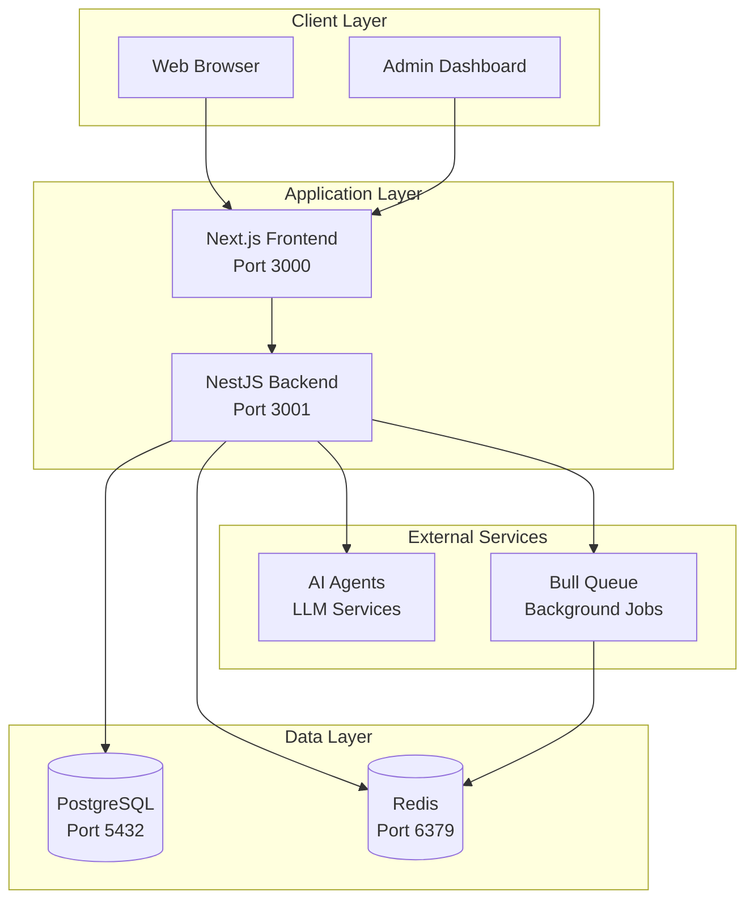
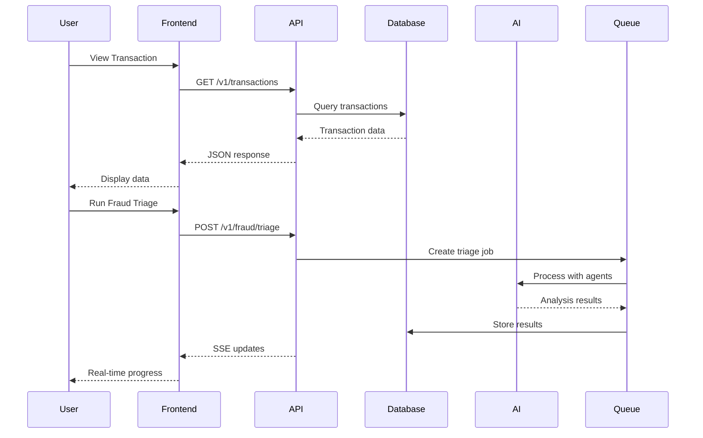
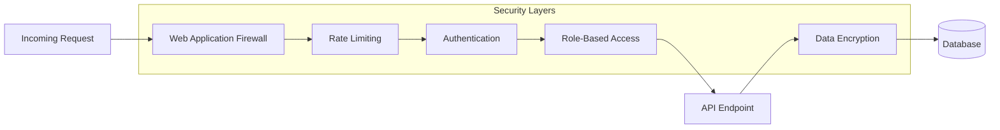
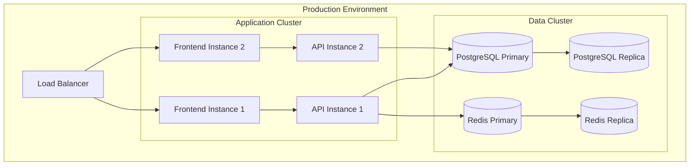
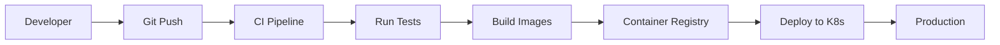

# Aegis Support - System Overview

## 🎯 Purpose

Aegis Support is a comprehensive fraud detection and customer support platform designed for financial institutions. It provides real-time transaction monitoring, fraud triage capabilities, customer insights, and automated risk assessment.

## 🏗️ High-Level Architecture

## 🔄 Data Flow

## 🧩 System Components

### Frontend (Next.js)
- **Purpose**: User interface for fraud analysts and support agents
- **Key Features**:
  - Real-time fraud queue monitoring
  - Transaction analysis dashboard
  - Customer insights and reports
  - Risk assessment visualization

### Backend (NestJS)
- **Purpose**: RESTful API and business logic layer
- **Key Features**:
  - Transaction processing and validation
  - Fraud detection algorithms
  - AI agent orchestration
  - Real-time SSE streaming
  - Background job processing

### Database (PostgreSQL)
- **Purpose**: Primary data storage
- **Stores**:
  - Customer profiles
  - Transaction history
  - Fraud alerts
  - Analysis results
  - Knowledge base articles

### Cache (Redis)
- **Purpose**: Session management and job queuing
- **Uses**:
  - API response caching
  - Bull queue job storage
  - Real-time event streaming
  - Rate limiting

## 🔐 Security Architecture

## 📊 Key Metrics & Monitoring

### Performance Metrics
- **API Response Time**: < 200ms (p95)
- **Fraud Detection Speed**: < 5s per transaction
- **Dashboard Load Time**: < 2s
- **Real-time Updates**: 5s polling interval

### Business Metrics
- **Alert Accuracy**: Tracked via evaluation system
- **False Positive Rate**: Monitored through feedback
- **Processing Volume**: Transactions per second
- **Agent Response Time**: Time to first action

## 🚀 Deployment Architecture

## 🔄 Continuous Integration/Deployment

## 📈 Scalability Considerations

### Horizontal Scaling
- **Frontend**: Stateless, can scale with demand
- **Backend**: Stateless API, scales behind load balancer
- **Database**: Read replicas for query distribution
- **Queue**: Redis cluster for job distribution

### Vertical Scaling
- **AI Processing**: GPU instances for LLM operations
- **Database**: High-memory instances for caching
- **Cache**: Memory-optimized Redis instances

## 🎯 Key Use Cases

1. **Real-time Fraud Detection**
   - Monitor incoming transactions
   - Apply ML models for risk scoring
   - Generate alerts for suspicious activity

2. **Customer Support Triage**
   - Analyze customer issues
   - Provide AI-powered recommendations
   - Track resolution metrics

3. **Risk Assessment**
   - Evaluate customer profiles
   - Generate risk reports
   - Monitor spending patterns

4. **Compliance Reporting**
   - Generate regulatory reports
   - Track audit trails
   - Monitor compliance metrics